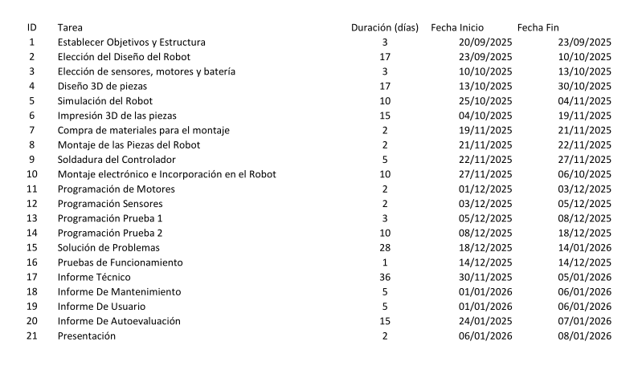
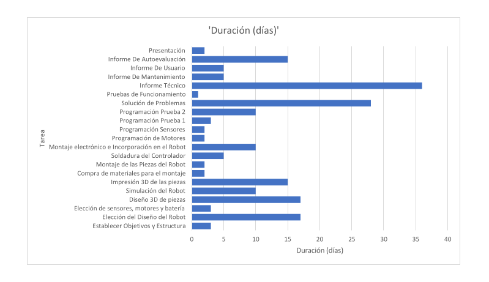

# Informe de Autoevaluación del Grupo

**Proyecto:** SpiderBot   
**Grupo:** 6
**Miembros:** Alejandro Gutiérrez, Wissal Abarkan, Marcos Useros y Mayra Madejón

---

## Criterios de Evaluación
Este informe cumple con los siguientes requisitos obligatorios:
1. Ponderación individual de 0 a 10.
2. Justificación explícita de participación y compromiso (>250 caracteres por miembro).
3. Desglose de tareas desempeñadas.

---

## Diagrama de Grant

## Evaluación de los Miembros

### 1. Alejandro Gutiérrrez
- **Ponderación:** **10/10**

#### Justificación de Participación y Compromiso:
>
> Este miembro asumió gran parte de la responsabilidad en tres áreas del proyecto: diseño, código y documentación. En la fase de Diseño 3D (Tarea 4), realizó el modelado de la mayoría de los componentes, específicamente la base, la caja, la protuberancia del servo y parte de los laterales.
>
> En el apartado de software, ejecutó la programación de los motores (Tarea 11) y de los sensores (Tarea 12), colaborando también en la realización de la Prueba 1. Finalmente, se encargó de la redacción y estructuración del Informe Técnico (Tarea 17). Su participación fue continua a lo largo de todas las etapas del cronograma, entregando los trabajos asignados.

---

### 2. Wissal Abarkan
- **Ponderación:** **10/10**

#### Justificación de Participación y Compromiso:

> Su participación abarcó fases de diseño, hardware y comunicación. En el Diseño 3D (Tarea 4), se encargó de la carcasa protectora para el sensor de ultrasonidos y colaboró en el diseño de los paneles laterales.
>
> En la fase de electrónica, dedicó una cantidad significativa de horas a la Soldadura del Controlador (Tarea 9). Aunque tras varios intentos de ensamblaje manual se decidió adquirir un componente comercial para garantizar la fiabilidad del robot, su dedicación y persistencia durante este proceso fueron altas. Finalmente, se encargó de la redacción del Informe de Usuario (Tarea 19) y de realizar la Presentación del proyecto (Tarea 21).

---

### 3. Marcos Useros
- **Ponderación:** **10/10**

#### Justificación de Participación y Compromiso:

> Este miembro desempeñó un papel técnico integral, conectando la fase virtual con la física. Fue el responsable de la **Simulación del Robot (Tarea 5)**, generando el modelo URDF mediante Blender y validando su comportamiento físico en el entorno PyBullet antes de la construcción.
>
> En la etapa de hardware, ejecutó el **Montaje electrónico e Incorporación en el Robot (Tarea 10)**, encargándose del cableado y la ubicación de los componentes internos. Además, desarrolló el código específico para el control manual del robot a través del mando, permitiendo su operación remota. Finalmente, recopiló las directrices de conservación y reparación en el **Informe de Mantenimiento (Tarea 18)**.
> ...

---

### 4. Mayra Madejón
- **Ponderación:** **10/10**

#### Justificación de Participación y Compromiso:

> Este miembro fue el responsable principal de la fase de materialización del proyecto. Gestionó la **Impresión 3D de las piezas (Tarea 6)**, supervisando los tiempos de fabricación y la calidad de los componentes físicos, además de colaborar previamente en el **Diseño 3D (Tarea 4)** de los paneles laterales.
>
> En el área de software, desarrolló el código para la **Programación de la Prueba 2 (Tarea 14)** y brindando soporte técnico en la **Prueba 1**, asegurando la optimitzación de las funcionalidades complejas del robot. Finalmente, se encargó de consolidar el análisis de rendimiento del grupo mediante la elaboración del **Informe de Autoevaluación (Tarea 20)**.

---

## Tareas Conjuntas y Dinámica de Grupo

Además de las responsabilidades individuales, el equipo ha colaborado de forma plena y coordinada en las siguientes fases críticas del proyecto:

### 1. Planificación y Toma de Decisiones
El establecimiento de objetivos y la estructura del proyecto (Tarea 1) se realizó mediante debate y consenso unánime. Para la **Elección del Diseño del Robot (Tarea 2)**, se discutieron varias alternativas, seleccionándose finalmente la propuesta conceptual presentada por el miembro **Wissal** por considerarse la más viable. De igual manera, la selección de sensores, motores y batería (Tarea 3) fue fruto de un análisis conjunto de las especificaciones técnicas requeridas.

### 2. Gestión de Compras y Presupuesto
La adquisición de materiales (Tarea 7) se gestionó de forma híbrida. Se realizaron pedidos online para componentes electrónicos específicos y salidas grupales a ferreterías locales para el material de montaje (tornillería, bridas, etc.). Los gastos derivados de la construcción del robot se dividieron de forma estrictamente equitativa entre todos los integrantes del equipo.

### 3. Solución de Problemas
La resolución de incidencias (Tarea 15) fue una tarea transversal en la que participó todo el grupo. No obstante, cabe destacar la intervención del miembro **Marcos** en esta fase, quien debió afrontar la mayor carga de trabajo debido a las dificultades técnicas surgidas en el montaje eléctrico, derivadas de la calidad de los materiales y las limitaciones presupuestarias.

### 4. Pruebas de Funcionamiento
La validación final del robot (Tarea 16) contó con la presencia y supervisión de todos los miembros. Sin embargo, es necesario mencionar que en las pruebas iniciales y la fase de depuración de código (*debugging*) para corregir errores críticos, la participación activa recayó principalmente en **Mayra** y **Marcos**.

### 5. Sinergia y Clima de Trabajo
Independientemente de la división formal de tareas detallada anteriormente, la dinámica general del grupo se caracterizó por una alta flexibilidad y apoyo mutuo. Todos los integrantes mostraron plena disposición para cubrir necesidades emergentes y asistir a sus compañeros fuera de sus responsabilidades estrictas siempre que fue necesario. Este clima de cooperación, sumado a un ambiente de trabajo positivo, ha sido determinante para superar los obstáculos técnicos y alcanzar unos resultados finales satisfactorios.