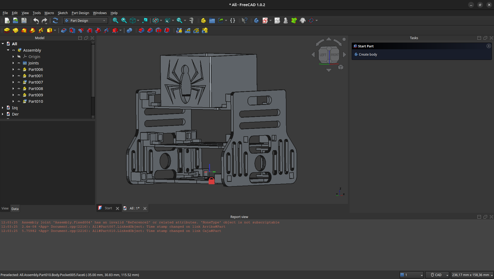

# Informe Técnico

## Índice
- [1. Introducción](#1-introducción)
- [2. Objetivos y planificación](#2-objetivos-y-planificación)
- [3. Diseño conceptual](#3-diseño-conceptual)
- [4. Diseño mecánico y electrónico](#4-diseño-mecánico-y-electrónico)
- [5. Fabricación](#5-fabricación)
- [6. Programación](#6-programación)
- [7. Pruebas y validación](#7-pruebas-y-validación)
- [8. Resultados](#8-resultados)
- [9. Conclusiones](#conclusiones)
- [Referencias](#referencias)

## 1. Introducción
- 1.1 Contexto y Motivación:

    Se nos pide hacer un robot capaz de moverse en un espacio reducido. Este debe transoportar una carga (250g) mientras esquiva obstáculos y llega a su objetivo lo antes podible. El robot debe tener obligatoriamente patas (8 en nuestro caso).

    Nos hemos inspirado en el robot [hola] que utiliza el mecanismo de Theo Jansen para mover las patas únicamente usando un motor (movimiento circular). Ovbiamente nos hemos inspirado también en un araña para hacer el diseño del robot, de ahí sus colores y símbolos típicos del famoso hombre-araña. 

- 1.2 Descripción General del Proyecto:

    Una "araña" robótica con locomoción a través del mecanismo Jansen, diseñada para el transporte de cargas ligeras en un entorno con obstáculos y paredes.

    Estructura impresa en 3D, previamente modelada en freeCAD
  Kit arduino UNO, 2 motores de corriente continua, 3 sensores ultrasónicos, 1 microservo 9g, 1 miniprotoboard, 1 [PCB].

  
## 2. Objetivos y planificación

## 3. Diseño conceptual

## 4. Diseño mecánico y electrónico

### 4.1 Diseño mecánico

### 4.2 Diseño electrónico

Para el control del robot se ha diseñado un PCB personalizado que actúa como escudo (shield) para el Arduino UNO. El diseño se ha realizado íntegramente en KiCad 9.0.6.

- Esquema Lógico: Se ha implementado un sistema que interconecta el microcontrolador con un driver de motores TB6612FNG, permitiendo el control independiente de los dos motores DC que accionan el mecanismo de Jansen.

- Gestión de Sensores: El diseño incluye puertos dedicados para tres sensores de ultrasonidos (frontal, izquierdo y derecho) y un microservo para la detección de obstáculos.

- Alimentación: El circuito integra una entrada de batería (V_BATT).

### 4.3 Diseño de la Placa de Circuito Impreso (PCB)

Una vez establecida la posición de los componentes, se procedió a la creación de las pistas de cobre siguiendo las guías de conexión del esquema:

- Ruteado Manual: Se han trazado todas las conexiones eléctricas utilizando pistas de cobre. Se ha priorizado evitar cruces de señales y mantener ángulos de 45° para asegurar la integridad de la fabricación.

- Verificación DRC: Se ha pasado el control de reglas de diseño (Design Rules Check) de KiCad, confirmando que no existen cortocircuitos ni pistas demasiado cercanas que impidan la fabricación.

## 5. Fabricación

Nuestro robot está inspirado en... [citar el robot ese]

En la carpeta [FreeCad_stls](FreeCad_Stls) tenemos los modelos 3D de todas las piezas. Respecto al original, hemos adaptado a nuestro problema las piezas centrales.
Primero necesitabamos ensanchar el cuerpo del robot para que los elementos necesarios quepan en él. Por lo tanto ensanchamos [PlantaBaja](FreeCad_Stls/Abajo.stl) y [PlantaMedia](FreeCad_Stls/Medio.stl). Hemos modificado [LateralDer](FreeCad_Stls/Der.stl) y [LateralIzq](FreeCad_Stls/Izq.stl) para que soporten una altura más, [PlantaArriba](FreeCad_Stls/Arriba.stl), de la misma forma que soportan las otras dos alturas. Esta planta superior sirve para dos cosas fundamentales: soportar la caja [Caja](FreeCad_Stls/Caja.stl) que llevará la carga pedida, y soportar el servo que cargará con la caja contenedora del sensor de ultrasonidos [CajaUS](FreeCad_Stls/CajaUS.stl).

En la imagen posterior tenemos una captura de pantalla de FreeCad de nuestras piezas centrales (cuerpo) ancladas como deberían ser fuera de la simulación.

### 5.2 Planteamiento y Preparación para la Fabricación del PCB

Aunque la validación final del prototipo se realizó mediante métodos de cableado físico y prototipado rápido, se ha completado toda la fase de ingeniería necesaria para su producción industrial:

- Generación de Archivos Gerber: Se ha procesado el diseño para obtener los archivos industriales estándar (formato RS-274X). Estos archivos contienen la información de las capas de cobre, máscara de soldadura y serigrafía necesaria para cualquier servicio de fabricación de PCB. [Ver carpeta](SpiderBot_KICAD/gerbers_spider)

- Escalabilidad: El diseño queda listo para una fase de producción en masa, lo que permitiría eliminar el cableado manual actual, reduciendo el peso total del robot y aumentando la fiabilidad ante las vibraciones del mecanismo Jansen.

- Validación de Montaje (3D): Se ha utilizado el motor de renderizado 3D de KiCad para verificar que la disposición de los componentes físicos (como el driver TB6612FNG y los sensores) no presenta interferencias mecánicas con el chasis del robot.

  

## 6. Programación

Hemos dividido el código arduino en 3 ficheros:
- Control.h: Constantes y librerías necesarias para la implementación del control remoto. De esta forma, basta con importar este archivo para poder ejecutar diferentes acciones dependiendo del botón pulsado.
- Spider.h: Clase que implementa las funcionalidades básicas del robot (move, turn, head_set_to, set_speed, get_dist). De esta forma tenemos el control del robot modulado y sus constantes (pines, umbrales) separadas del código principal).
- Spider.ino: Código principal del robot. Usa los archivos anteriores para completar el problema propuesto. Problemas específicos como seguir la pared o comprobar si hay un obstáculo, se modulan mediante métodos (follow_wall, is_obstacle). Usando estas funciones y mediante una máquina de estados, somos capaces de resolver el ejercicio propuesto. Somos capaces de cambiar entre ejercicios usando el control remoto previamente mencionado (cambia la variable de estado). Hemos evitado en la medida de lo posible utilizar delays, con el fin de hacer el programa lo más reactivo posible.

- Métodos del código principal:
  - follow_wall: Utilizamos un PD para seguir la pared, usando la distancia recogida por el ultrasonidos lateral correspondiente como error comprandolo con una distancia arbitraria.
  - is_obstacle: Sigue el básico concepto de, si abajo veo algo pero arriba no, es un obstáculo. Esto se debe a que lo obstáculos nunca serán más altos que 10cm, por lo que con dos simples vistazos del ultrasonidos (movido verticalmente por el servo) podemos diferenciar una pared de un objeto obstáculo.

## 7. Pruebas y validación

[video]
[video]

## 8. Resultados

## 9. Conclusiones

## Referencias
