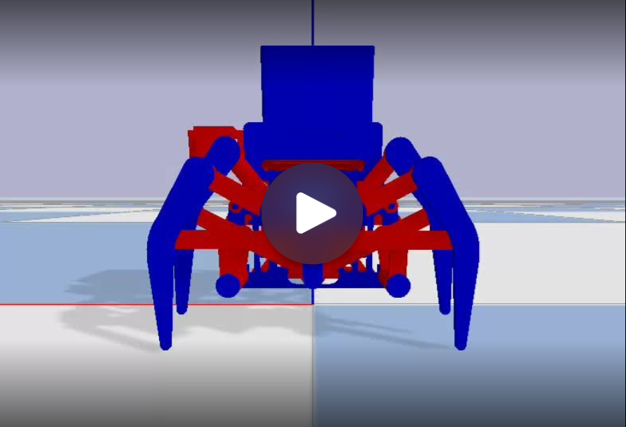
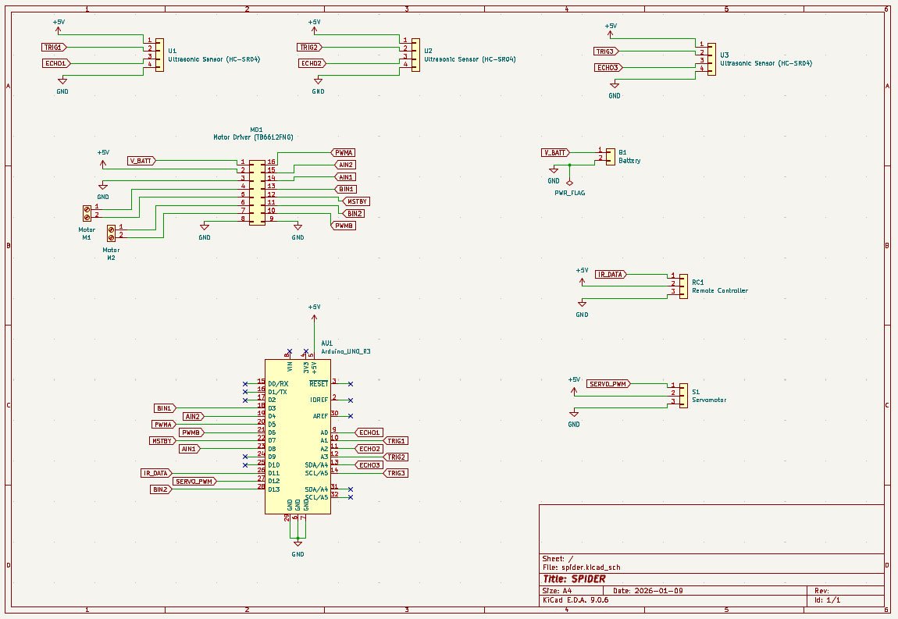
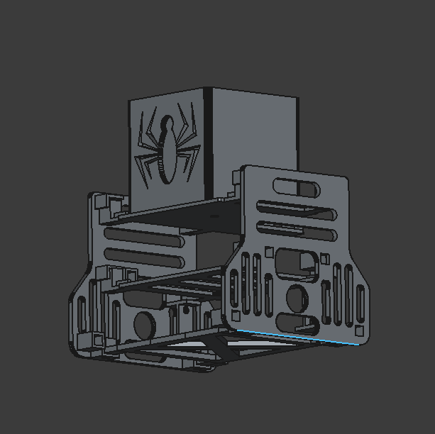
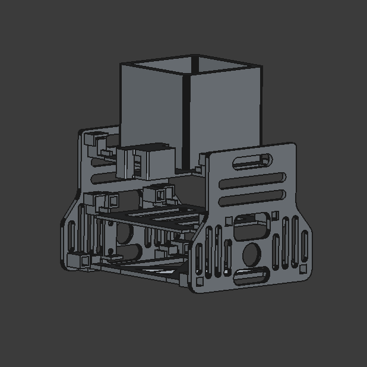
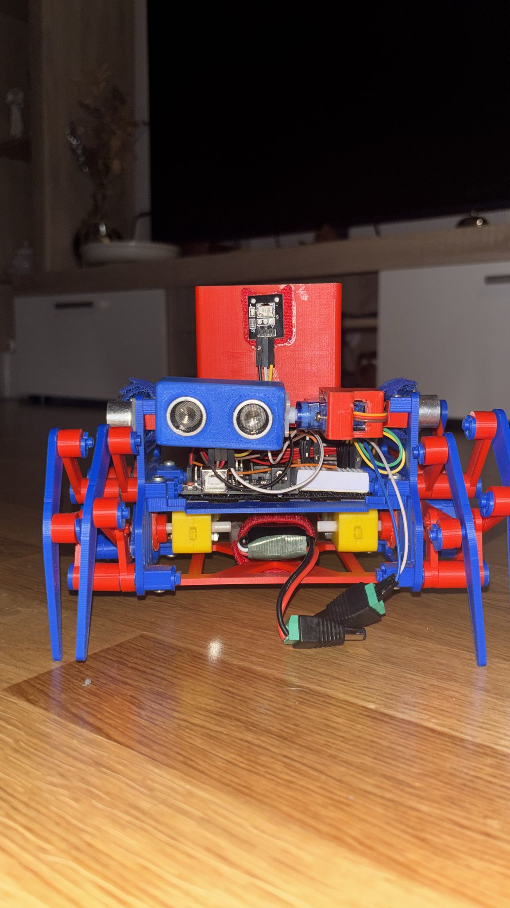
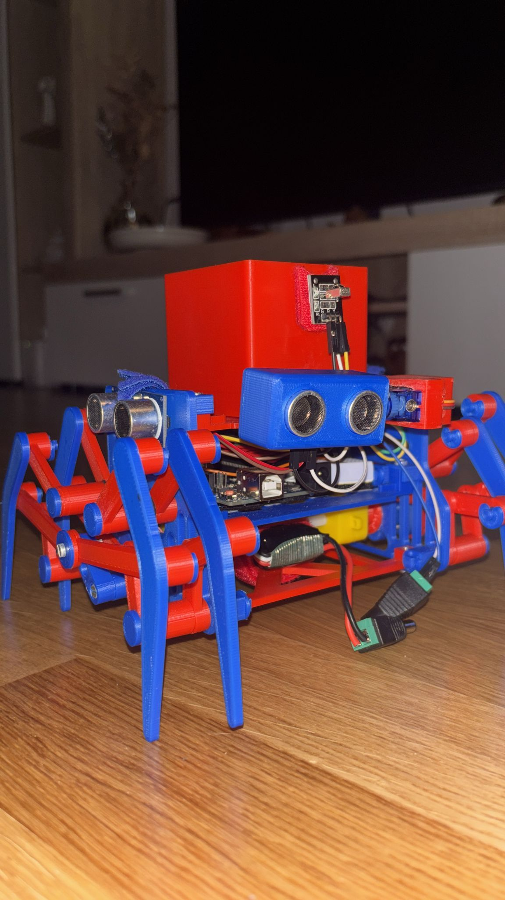
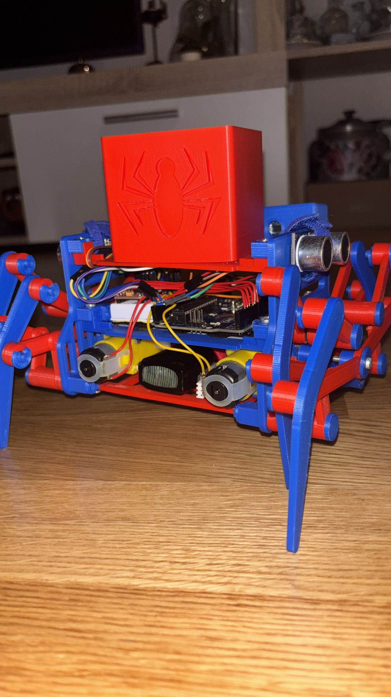
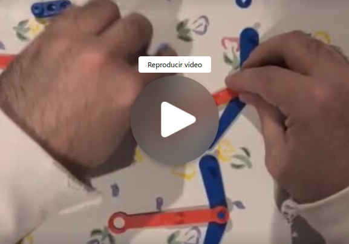
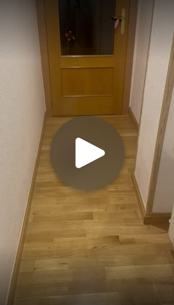
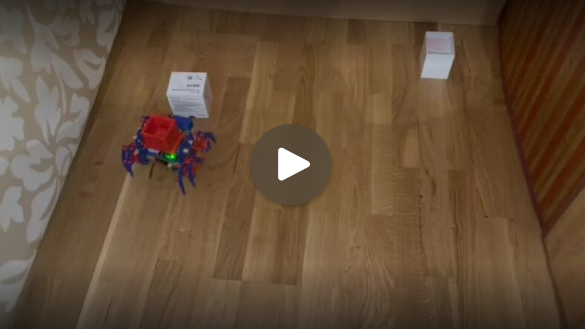

# Informe Técnico

## Índice
- [1. Diseño conceptual](#1-diseño-conceptual)
- [2. Diseño detallado](#2-diseño-detallado)
- [3. Integración](#3-integración)
- [4. Fabricación](#4-fabricación)
- [5. Programación](#5-programación)
- [6. Pruebas](#6-pruebas)
- [7. Resultados y conclusiones](#7-resultados-y-conclusiones)
- [Referencias](#referencias)

## 1. Diseño conceptual
### 1.1 Descripción General del Proyecto:
  
Se requiere la creación de un robot capaz de desplazarse en espacios reducidos. El dispositivo debe transportar una carga de 250g, esquivar obstáculos y alcanzar su objetivo con la mayor eficiencia temporal posible. Es obligatorio que el robot cuente con un sistema de locomoción por patas (8 unidades en este caso).

- La solución propuesta consiste en una "araña" robótica con locomoción basada en el mecanismo Jansen, diseñada para el transporte de cargas ligeras en entornos con obstáculos y paredes. La estructura se realiza mediante impresión 3D, previo modelado en FreeCAD. El control se ejecuta a través de Arduino, con opción de operación mediante control remoto.

- El diseño se basa en el modelo original de **MERT KILIC** [Build a Walking Robot Theo Jansen Style](https://www.pcbway.com/project/shareproject/Build_a_Walking_Robot_Theo_Jansen_Style_3D_Printed_Octopod_41bd8bdb.html), adaptándolo para resolver la problemática planteada. En el apartado [4. Fabricación](#4-fabricación) se exponen detalladamente estos cambios.

- El **mecanismo de Theo Jansen** permite el movimiento del robot empleando únicamente 2 motores. El movimiento circular se transfiere desde cada motor a las 4 patas de cada lateral. Es posible realizar movimientos de traslación (avance y retroceso) y rotación sobre el eje propio gracias al puente H, que permite programar los motores en Arduino para invertir el sentido de giro. En el apartado de [2.2 Simulación](#22-simulación) podemos ver como funciona este mecanismo en nuestro robot simulado.

### 1.2 Elementos escogidos:

x1 Kit Arduino UNO
x2 motores de corriente continua
x3 sensores ultrasónicos
x1 microservo 9g
x1 miniprotoboard
x1 puente H
x1 control - receptor IR.

- Se ha seleccionado el **microcontrolador Arduino UNO** debido a la experiencia previa con la plataforma y su facilidad de programación. Los 2 sensores ultrasónicos laterales se destinan principalmente al seguimiento de paredes, funcionando también como apoyo en la evasión de obstáculos. El sensor ultrasónico central mide la distancia frontal y permite diferenciar entre una pared y un obstáculo en la trayectoria.

- El **control remoto**, mediante la señal enviada al receptor IR, permite la conmutación de estados del robot para la resolución de los ejercicios propuestos. Se dispone, además, de un botón de parada de emergencia.

- En el aspecto estético, debido a la configuración de 8 patas y el estilo arácnido, el proyecto se inspira en el personaje Spider-man, incorporando detalles y colores representativos. Esto resulta en un robot más llamativo y con una interfaz visual amigable para el usuario.

## 2. Diseño detallado

### 2.1 Modelado
En la carpeta [FreeCad_stls](FreeCad_Stls) se encuentran disponibles los modelos 3D de todas las piezas. Respecto al diseño original, se han adaptado las piezas centrales para adecuarlas al problema actual:

- Se requiere aumentar el cuerpo del robot para alojar los elementos necesarios. Por ello, se procede al ensanchamiento de [BaseBaja](FreeCad_Stls/Abajo.stl) y [BaseMedia](FreeCad_Stls/Medio.stl).
- Se han modificado [LateralDer](FreeCad_Stls/Der.stl) y [LateralIzq](FreeCad_Stls/Izq.stl) para soportar un nivel adicional, la [BaseArriba](FreeCad_Stls/Arriba.stl), siguiendo el sistema de anclaje de los niveles inferiores.
- Esta Base superior cumple dos funciones fundamentales: soportar la [Caja](FreeCad_Stls/Caja.stl) de transporte de carga y alojar el servo conectado al contenedor del sensor de ultrasonidos [CajaUS](FreeCad_Stls/CajaUS.stl).

### 2.2 Simulación
La parte de la simulación se realizó para tener una referencia real antes de imprimir para confirmar que el movimiento era correcto.

El desarrollo del modelo en formato **URDF** presenta una limitación crítica: este estándar está diseñado para estructuras jerárquicas (árboles) y no permite de forma nativa la creación de **joints dobles** o bucles cinemáticos cerrados. Dado que el mecanismo de las patas requiere este tipo de conexiones para funcionar, el formato URDF impide representar la interdependencia mecánica real del robot de forma directa.

Para solventar esta restricción y lograr una simulación funcional, se ha seguido este procedimiento:

* **Generación del modelo:** Se ha utilizado **Blender** con la extensión **Phobos** para crear una estructura compatible que pueda ser exportada y procesada.
* **Implementación de Constraints:** En el entorno de **PyBullet**, se ha empleado la herramienta `constraint` para vincular físicamente las piezas. Su función es emular el comportamiento de un *joint* de cierre, permitiendo que las patas se muevan de forma sincronizada.
* **Análisis de resultados:** Es necesario señalar que el uso de estos *constraints* introduce fuerzas artificiales en las gráficas de la simulación. Al intentar mantener la cohesión de elementos que estructuralmente están "colgando" en el URDF, se genera una carga adicional en los motores que no corresponde con el comportamiento del modelo físico real, donde el movimiento es más fluido.

  

### 2.3 Diseño electrónico

Para el control del robot se ha diseñado un PCB personalizado que actúa como shield para el Arduino UNO. El diseño se ha realizado íntegramente en KiCad 9.0.6.

- **Esquema Lógico:** Se ha implementado un sistema que interconecta el microcontrolador con un driver de motores TB6612FNG, permitiendo el control independiente de los dos motores DC del mecanismo Jansen.

- **Gestión de Sensores:** El diseño incluye puertos dedicados para tres sensores de ultrasonidos (frontal, izquierdo y derecho) y un microservo para la detección de obstáculos.

- **Alimentación:** El circuito integra una entrada de batería (V_BATT).

#### Diseño de la Placa de Circuito Impreso (PCB)

Tras establecer la posición de los componentes, se procedió a la creación de las pistas de cobre siguiendo el esquema de conexiones:

- **Ruteado Manual:** Se han trazado todas las conexiones eléctricas utilizando pistas de cobre, priorizando la ausencia de cruces de señales y manteniendo ángulos de 45° para asegurar la integridad de la fabricación.

- **Verificación DRC:** Se ha ejecutado el control de reglas de diseño (Design Rules Check) de KiCad, confirmando la inexistencia de cortocircuitos o proximidad excesiva entre pistas.

## 3. Integración
### Planteamiento y Preparación para la Fabricación del PCB

Aunque la validación final del prototipo se realizó mediante cableado físico y prototipado rápido, se ha completado la ingeniería necesaria para su producción:

- **Generación de Archivos Gerber:** Se ha procesado el diseño para obtener los archivos industriales estándar (formato RS-274X). Estos contienen la información de capas de cobre, máscara de soldadura y serigrafía. [Ver carpeta](SpiderBot_KICAD/gerbers_spider)

- **Escalabilidad:** El diseño permite una transición a producción en masa, eliminando el cableado manual, reduciendo el peso y aumentando la fiabilidad ante vibraciones.

- **Validación de Montaje (3D):** Se ha empleado el motor de renderizado 3D de KiCad para verificar que la disposición de los componentes físicos no presenta interferencias mecánicas con el chasis del robot.

## 4. Fabricación

Con los modelos stl, se puede proceder a la fabricación de la estructura con una impresora 3D utilizando los filamentos indicados. (Algunas piezas necesitaron ser limadas por errores comunes de impresión)

Materiales:
* Filamentos PLA+ de 1.75mm con precisión de +- 0.02 mm

### 4.1 Montaje

Una vez obtenidas las piezas de la estructura, se procede al ensamblaje mediante los tornillos especificados. En las imágenes posteriores se muestran las piezas del cuerpo con su correspondiente dispoisición.

Materiales:
* x12 Tornillos M3 12 mm
* x2 Tornillo M3 10 mm
* x2 Tornillo M3 15 mm
* x2 Tornillo M3 20 mm
* x4 Tornillo M3 25 mm
* x4 Tuercas M3
* x1 Tornillo M5 10 mm
* x1 Tuerca M5
* x2 Tornillo M2 8 mm
* x1 Tornillo M1 5 mm
* Bridas de velcro

- Se atornillan las 3 Bases con los laterales utilizando los tornillos M3 10 mm.

- La caja se atornilla con un tornillo M5 10 mm y su tuerca correspondiente para asegurarla.

- Los motores van atornillados con los M3 25 mm y sus tuercas en la Base inferior, dejando uno de sus ejes sobresaliendo por el lateral para conectar los conjuntos de patas.

- El servo se coloca en el espacio dispuesto para él en la parte frontal del robot, atornillado con los M2 8 mm.

- El ultrasonidos central va dentro de su caja y tapa correspondiente [CajaUS](FreeCad_Stls/CajaUS.stl), y esta caja conectada con el tornillo M1 5 mm al servo para que gire verticalmente.

- Para terminar el cuerpo se colocan: la batería, el microcontrolador, la miniprotoboard el puente H y los 2 ultrasonidos laterales con las bridas de velcro. Con esto es suficiente a su sujección y facilita mucho el montaje.

  

Por último, arriba se incluye un videotutorial para el montaje de las patas, las cuales deben conectarse a los ejes de los motores que sobresalen del chasis.

### 4.2 Circuito
FRIZTING!!!!!
[alguien porfa ayuda]

## 5. Programación

El código de Arduino se divide en 3 ficheros:
- [Control.h](Spider/Control.h): Contiene constantes y librerías necesarias para la implementación del control remoto. Esto permite ejecutar diferentes acciones según el botón pulsado mediante la importación del archivo.
- [Spider.h](Spider/Spider.h): Clase que implementa las funcionalidades básicas (move, turn, head_set_to, set_speed, get_dist). El control se encuentra modulado y las constantes (pines, umbrales) están separadas del flujo principal.
- [Spider.ino](Spider/Spider.ino): Código principal. Utiliza los archivos anteriores para la resolución del problema. Funciones específicas como el seguimiento de pared o la comprobación de obstáculos se modulan mediante métodos (`follow_wall`, `is_obstacle`). A través de una máquina de estados se resuelven los ejercicios propuestos, permitiendo el cambio entre ellos mediante el control remoto. Se ha evitado el uso de `delays` para garantizar la máxima reactividad del programa.

#### Métodos del código principal:
  - **follow_wall:** Se utiliza un control PD para el seguimiento de pared, empleando la distancia del sensor ultrasónico lateral como error respecto a una distancia de referencia.
    
  - **confirm_obstacle:** Se basa en el principio de detección diferencial: si hay detección en el plano inferior pero no en el superior, se identifica un obstáculo. Dado que estos no superan los 10cm, dos mediciones del sensor (desplazado verticalmente por el servo) permiten diferenciar una pared de un objeto.
    
  - **avoid_obstacle:** Esquive simple. Si gira 90º aprox., avanza hasta que deja de ver el obstáculo con el us lateral. Vuelve a girar 90º para continuar avanzando de manera normal. Durante su ejecución se sigue comprobando si hay obstáculos delante.

## 6. Pruebas
Se puede cambiar entre los diferentes casos con el control remoto. Todos se pueden lograr llevando la carga requerida. Abajo hay una explicación de ellos y videos de prueba.

- **Caso 0**: Manual. Movimiento básico del robot con el control remoto. (FORWARD, BACKWARD, TURN_LEFT, TURN_RIGHT)
  
- **Caso 1**: Seguir pared paralelamente con distnacia preventiva. Para esto se usa el método follow_wall únicamente.
  
- **Caso 2**: Tocar las 4 paredes esquivando obstáculos. Utiliza todos los métodos creados, cambiando de estado dependiendo de la situación. No tiene la necesidad de seguirlas paralelamente pero si no encuentra obstáculos lo hace.

  <table>
    <tr>
      <td align="center"><b>Prueba Caso 1: Con carga</b></td>
      <td align="center"><b>Prueba Caso 2: Sin carga</b></td>
    </tr>
    <tr>
      <td align="center">
        
      </td>
      <td align="center">
        
      </td>
    </tr>
  </table>

## 7. Resultados y conclusiones
- Se han presentado los numerosos errores, sobretodo con cosas inesperadas como elementos desgatados o rotos. A pesar de ello, hemos podido hacer que nuestro robot sea funcional y que complete los ejercicios propuestos cumplieando con los plazos y las limitaciones.

- Este proyecto tiene mucho futuro sobretodo para fines educativos. La interacción con el usuario es amigable dado su diseño. Con los correctos ajustes y preparaciones, puede ser fácil de programar e incluso montar. Además, su transporte de cargas pequeñas puede resultar entretenido por un lado y educativo para aprender sobre la importancia de los pesos en la robótica móvil. Al implementar el mecanismo de Theo Jansen, también se aprendería sobre este y su utilidad.

## Referencias
Kilic, M. (2024). Build a Walking Robot Theo Jansen Style 3D Printed Octopod [Proyecto de Hardware Open Source]. PCBWay Community. https://www.pcbway.com/project/shareproject/Build_a_Walking_Robot_Theo_Jansen_Style_3D_Printed_Octopod_41bd8bdb.html

N_O_A_H. (2020). *Case for HC-SR04 ultrasonic module distance sensor for Arduino Raspberry Pi* [Modelo 3D]. Cults3D. https://cults3d.com/en/3d-model/gadget/case-for-hc-sr04-ultrasonic-module-distance-sensor-for-arduino-raspberry-pi
